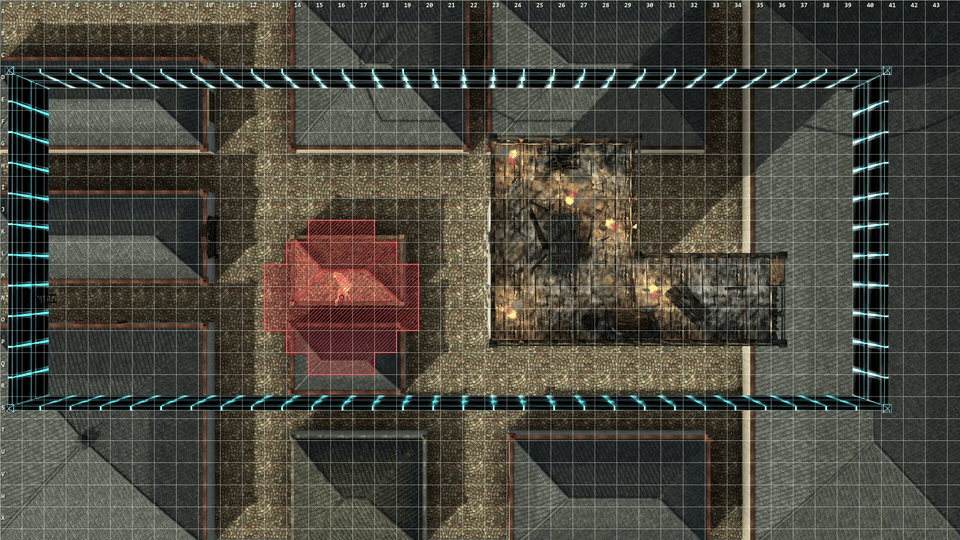

# Battlemap

The battlemap feature turns a screen, typically a TV lying flat under glass, into a battle map for physical miniatures. It shows a backdrop (a still image or a looping video), draws a grid whose cells are exactly one inch on the physical screen, labels cells with coordinates, and places sprites and areas of effect on the grid.



Everything is controlled with `map` commands. `map help` lists them in the shell; the [command reference](#command-reference) below has the same list with examples.

## Calibration

The grid is defined in physical inches, not in pixels. The pixel density of the screen is derived from its physical diagonal and the resolution of the monitor the window is on:

```toml
[features.battlemap]
window = "battlemap"
screen_diagonal_in = 50     # physical diagonal of the table screen, in inches
cell_size_in = 1.0          # one grid cell, in inches
# pixels_per_inch = 88.1    # override if the measured grid is off
grid_color = "#ffffff"
grid_width = 1
coords_style = "letters"    # letters (E8) | numbers (5,8)
coords_location = "sides"   # sides | cells
# coords_color = "#ffffff"  # defaults to grid_color
```

A 50" 4K TV works out to about 88.1 pixels per inch, giving a grid of roughly 44 by 25 one-inch cells. `map grid` prints the values in use and where they came from, which makes it easy to check the result with a ruler. If the measured cells are off, `pixels_per_inch` overrides the calculation.

The grid always covers the whole window, starting at the top-left corner, so the right and bottom edges usually end in partial cells. `map grid resize <percent>` changes the cell size relative to the calibrated size for the rest of the session (100 restores it); it is never written back to the configuration.

### Preparing maps

The backdrop is stretched to fill the window, so the map's own grid lines up with the drawn grid only if the map is made for the screen. For the 50" 4K TV above, that means a map with a 16:9 aspect ratio of roughly 44 by 25 squares. A map exported with a different aspect ratio is stretched slightly, and a different number of squares makes the map's grid drift from the drawn grid towards the right and bottom edges.

## Coordinates

Cells are numbered from the top-left, starting at 1, and are always written **row first**:

| Style | Row 5, column 8 | Rows | Columns |
|---|---|---|---|
| `letters` (default) | `E8` | A, B, C, ... Z, AA, AB, ... | 1, 2, 3, ... |
| `numbers` | `5,8` | 1, 2, 3, ... | 1, 2, 3, ... |

Rows get the letters because the screen is wider than it is tall: at one-inch cells a 4K TV has 25 rows (A to Y) and 44 columns, so the letters never need to double up.

Commands accept both styles at any time, in upper or lower case; output always uses the active style. A range of cells is written as two opposite corners separated by a colon: `B3:C5` (or `2,3:3,5`), in any order.

For areas of effect, an origin can also be the top-left corner of a cell, the grid intersection, by adding `c`: `E8c` or `5,8c`.

## Backdrops

`map show <file>` loads an image or a video from `assets/images` and shows the battlemap window. `map bgclear` removes the backdrop and leaves the grid, sprites and areas of effect in place.

Images in any format Pillow can read are supported. They are scaled to fill the window.

### Animated backdrops

`.webm` files are played as looping animated backdrops. Frames are decoded on a background thread and streamed to the screen, so memory use does not depend on the length of the video. Playback is capped at 15 frames per second and pauses while the window is hidden.

The limiting factor is the time Tk needs to put a full-screen frame on the display: about 35 ms per 4K frame. That rules out 4K at 30 frames per second but leaves comfortable headroom at 15. Videos exported by tools such as Dungeon Alchemist are often much larger than 4K and run at 30 frames per second; the largest ones cannot even be decoded in real time. `map show` warns about such files and prints the command to convert them once with [FFmpeg](https://ffmpeg.org/):

```
ffmpeg -i "in.webm" -vf "fps=15,scale=3840:2160:flags=lanczos" -an -c:v libvpx-vp9 -crf 32 -b:v 0 -row-mt 1 -deadline good -cpu-used 4 "out_4k15.webm"
```

The converted file is usually much smaller as well. A 440 MB, 13500x7500 export became a 56 MB file in under a minute.

## Grid and coordinate labels

`map grid on` and `map grid off` show and hide the grid lines. The coordinate labels are independent of the lines, which is useful for maps that already have a grid printed on them, but they follow the same cell size.

`map coords on` shows the labels in one of two places:

- `sides`: column numbers along the top edge and row labels along the left edge, inside the first row and column.
- `cells`: the full coordinate in the top-left corner of every cell, where a miniature standing in the middle does not cover it.

Labels get a dark shadow so they stay readable on light and dark maps. The font scales with the cell size, and labels are hidden when cells become too small to hold them; a smaller `map grid resize` can hide the in-cell labels while the side labels remain.

## Sprites

A sprite is an image placed on the grid: a piece of furniture, a door, a token, an effect. Sprites are taken from `assets/images` like backdrops.

```
map sprite add chest.png E8                 a sprite in one cell, named sprite1
map sprite add rug.png B3:C5 as rug         a sprite covering a range of cells
```

### Footprints

A sprite's location and size are the same thing: its **footprint**, the cell or range of cells it covers. The image is scaled to fit inside the footprint with its proportions kept, and centred. To make a sprite bigger, its footprint is changed:

```
map sprite resize rug B3:D6      the rug now covers 4 rows and 4 columns
map sprite move rug F10          the top-left corner moves to F10; the size stays
```

`move` takes a single cell and never changes the size. `resize` takes the complete new range and may also shift the sprite.

### Rotation

`map sprite rotate <name> <degrees>` rotates clockwise, relative to the current rotation; negative values rotate counter-clockwise. The rotated image is fitted into the footprint, so a long sprite rotated by 90 degrees shrinks until it fits its old footprint. Resizing the footprint afterwards (for example from `B3:B5` to `B3:D3`) restores the full size.

### Animated sprites

Animated GIF, APNG and animated WebP files play in place. All animated sprites share one clock with the video backdrop, sprites using the same file stay in sync, and an animation keeps its timing when the grid is resized. All frames of an animated sprite are kept in memory at display size; when that exceeds 400 MB, a warning is printed, but the sprite is still shown.

### Names

Sprites without a name are called `sprite1`, `sprite2` and so on. Numbers are never reused, so a name always refers to the same sprite for the rest of the session. Custom names given with `as` may contain letters, digits, `_` and `-`, and must be unique (case-insensitive). `map sprite list` shows all sprites with their footprints.

Sprites stay on the grid when the backdrop changes. `map sprite clear` removes all of them at once.

## Areas of effect

Areas of effect are drawn as hatched cells with an outline and a dot at the origin. Each one gets its own colour, so overlapping areas remain distinguishable. All sizes are in feet and must be multiples of 5; one cell is 5 feet. Diagonal distance follows the 5-10-5 rule: the first diagonal step costs 5 feet, the second 10, the third 5, and so on.

Every shape is written in the same order, shape, origin and size, followed by extra arguments for cones:

```
map aoe sphere <origin> <radius>                       [as <name>]
map aoe cube   <corner> <size>                         [as <name>]
map aoe cone   <cell>   <length> <direction> [mirror]  [as <name>]
```

| Shape | Origin |
|---|---|
| sphere | A cell (`E8`) or a cell's top-left corner (`E8c`) |
| cube | A corner only (`E8c`): the cube's top-left corner |
| cone | A cell only (`E8`): the caster's cell |

Using the wrong kind of origin gives an error that explains the correct form.

The examples below use `O` for the origin cell and `X` for affected cells.

**Sphere from a cell**, `map aoe sphere E8 10`: every cell within 10 feet of E8, counted from cell to cell.

```
     6 7 8 9 10
C    . X X X .
D    X X X X X
E    X X O X X
F    X X X X X
G    . X X X .
```

**Sphere from a corner**, `map aoe sphere E8c 10`: measured from the point between D7, D8, E7 and E8. The four cells touching that point count as 5 feet away.

```
     6 7 8 9
C    . X X .
D    X X X X
E    X X X X
F    . X X .
```

**Cube**, `map aoe cube E8c 15`: three by three cells, extending right and down from the top-left corner of E8. The origin is a corner of the cube, not its centre.

```
     8 9 10
E    X X X
F    X X X
G    X X X
```

**Cone along a row or column**, `map aoe cone E8 15 e`: starts next to the caster and widens by one cell per step. Steps with an even width cannot be centred and lean down (east and west cones) or right (north and south cones); `mirror` makes them lean the other way.

```
     8 9 10 11              with mirror:   8 9 10 11
D    . . .  X                          D   . . X  X
E    O X X  X                          E   O X X  X
F    . . X  X                          F   . . .  X
```

**Diagonal cone**, `map aoe cone E8 15 se`: every cell within range in the quarter ahead of the caster. `mirror` does not apply to diagonal cones.

```
     8 9 10 11
E    O . .  .
F    . X X  X
G    . X X  .
H    . X .  .
```

Directions are `n`, `ne`, `e`, `se`, `s`, `sw`, `w` and `nw`, with north at the top of the screen.

`map aoe move <name> <origin>` moves an area to a new origin. The origin follows the same rules as when the area was created; a sphere may switch between a cell and a corner origin. To change the shape, size or direction, the area is removed and created again.

## Fog of war

`map fow on` covers the whole map in solid black. Parts of it are uncovered with `map fow reveal`, using the same cells and ranges as sprites, and covered again with `map fow hide`:

```
map fow on
map fow reveal B2:E8       the room the party is in
map fow reveal F3:G5       the corridor ahead
map fow hide C3            a door closes
map fow off                everything visible again
```

Reveals add up, and `map fow` on its own prints whether fog is on and how many cells are revealed. `map fow off` removes the fog and forgets all reveals, so the next `map fow on` starts with the whole map hidden again.

The fog hides the backdrop and the sprites under it, which allows traps, treasure or monsters to be placed in advance; they appear when their cells are revealed. Areas of effect, the grid and the coordinate labels are drawn on top of the fog and stay visible. Loading a different backdrop with `map show` keeps the fog on or off as it was; when it is on, the new map starts fully hidden.

The fog is opaque because Tk canvases do not support transparency. Reveals are stored in cells, like sprites, so they follow `map grid resize`; the backdrop does not change with the grid, so after a resize a revealed area no longer covers exactly the same part of the map image.

## Command reference

| Command | Description |
|---|---|
| `map show <file>` | Load an image or `.webm` video from `assets/images` and show the window |
| `map bgclear` | Remove the backdrop |
| `map fullscreen` | Borderless fullscreen on the monitor the window is on |
| `map restore` | Default window size; also brings the window back after it was closed |
| `map grid` | Grid status and calibration |
| `map grid on` / `off` | Show or hide the grid lines |
| `map grid resize <percent>` | Cell size as a percentage of the calibrated size (10 to 1000) |
| `map coords` | Coordinate label status |
| `map coords on` / `off` | Show or hide coordinate labels |
| `map coords style letters` / `numbers` | Notation for labels and output |
| `map coords location sides` / `cells` | Where the labels are drawn |
| `map sprite add <file> <cell or range> [as <name>]` | Place a sprite |
| `map sprite move <name> <cell>` | Move a sprite's top-left corner, keeping its size |
| `map sprite resize <name> <range>` | Set a sprite's footprint |
| `map sprite rotate <name> <degrees>` | Rotate clockwise by the given angle |
| `map sprite remove <name>` | Remove one sprite |
| `map sprite list` | List all sprites |
| `map sprite clear` | Remove all sprites |
| `map aoe sphere <origin> <radius> [as <name>]` | Spherical area |
| `map aoe cube <corner> <size> [as <name>]` | Cubic area |
| `map aoe cone <cell> <length> <direction> [mirror] [as <name>]` | Cone |
| `map aoe move <name> <origin>` | Move an area to a new origin |
| `map aoe remove <name>` | Remove one area |
| `map aoe list` | List all areas |
| `map aoe clear` | Remove all areas |
| `map fow` | Fog of war status |
| `map fow on` / `off` | Hide the whole map / remove the fog (and forget reveals) |
| `map fow reveal <cell or range>` / `hide <cell or range>` | Uncover or cover part of the map |

## How it is drawn

Everything is drawn on a single Tk canvas in layers, from bottom to top: backdrop, sprites, fog of war, areas of effect, grid, coordinate labels. Grid lines and labels therefore stay visible on top of everything, areas are drawn over sprites and fog, and the fog hides the backdrop and sprites.

Only the backdrop is expensive to redraw: scaling a 4K image takes noticeable time and memory. Changes to the other layers never cause the backdrop to be redrawn, and a video backdrop reuses one image for every frame.

The shared state (backdrop, cell scale, coordinate style, sprites and areas of effect) lives in `BattleMapState`. What a particular window shows, such as whether the grid or labels are visible and where the labels go, belongs to the view. This keeps a possible second view, for example a copy of the map on the game master's screen, consistent with the table.

## Files

| File | Contents |
|---|---|
| `__init__.py` | The feature: `map` commands, reports, grid calibration and tab completion |
| `model/battlemap_state.py` | Shared state: backdrop, cell scale, coordinate style, sprites, areas of effect |
| `model/grid.py` | Calibration, cell geometry, coordinate parsing and labels, cell ranges |
| `model/aoe.py` | Area of effect command parsing and the cells each shape covers |
| `sprite_images.py` | Reading, rotating and scaling sprite images and animation frames |
| `video.py` | Streaming `.webm` decoder running on a background thread |
| `views/battlemap_view.py` | The canvas and its layers |
| `views/animation.py` | The shared animation clock, the video backdrop and sprite animations |
| `styling.py` | Colours used by the view |

The modules under `model/`, `sprite_images.py` and `video.py` do not use Tk, which keeps the geometry and parsing testable without a display.
