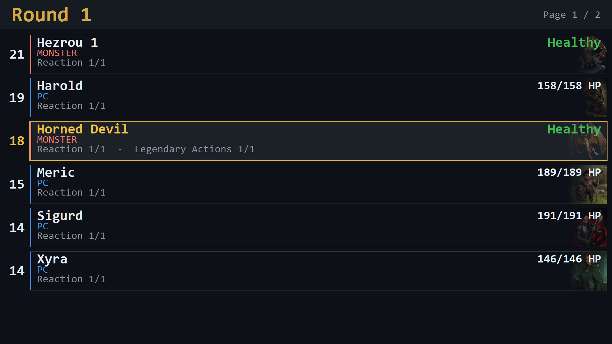

# Combat

The combat feature is an initiative and hit point tracker for D&D 5e. The game master manages the encounter from the shell; the players see a combat screen with the turn order, the active combatant and how everyone is doing. It is bookkeeping only: rules are not enforced, and every number can be changed at any time.



`combat help` lists the commands in the shell. The combat screen shares its window with the image viewer: it appears when combat starts and is replaced when an image is shown. `combat show` brings it back.

## Running an encounter

```
combat add Aria 18 pc 52
combat add Brann 11 pc 64
combat add Goblin-A 14 monster 7
combat add Goblin-B 14 monster 7
combat start
next
hp Goblin-A -6
combat action Aria damage Goblin-B 9 fire
next
...
combat end
```

`combat add <name> <initiative> <type> <hp> [current hp]` adds a combatant. The type is `pc`, `npc` or `monster`. Names must be unique; quotes allow spaces (`"Red Dragon"`). Every combatant gets a Reaction, unless `combat noreaction` was given just before the `combat add`.

`combat start` sorts everyone by initiative and starts round 1. When two or more combatants share an initiative value, the shell asks for their order first (for example `2 1 3`).

`next` moves to the next turn and starts a new round after the last combatant. At the start of a combatant's turn, their Reaction and legendary actions are refilled. The combat screen follows the active combatant to the page it is on.

`combat end` clears the encounter; `combat new` clears the roster to prepare a new one. Both ask for confirmation when the combat log has unsaved entries.

## What the players see

Combatants are listed in initiative order with the active one highlighted. As many rows are shown per page as fit in the window: the size of a row follows its text, not the window, so a larger window shows more combatants rather than larger ones.

- Player characters show their exact hit points. NPCs and monsters show a descriptive state instead: Healthy, Bloodied, Wounded, Near Death or Defeated, with a coloured bar.
- Monsters stay hidden until their first turn. Before that, they are shown greyed out at the bottom of the list, so players cannot read the monsters' initiative from the order.
- Combatants added during combat are pending: they are shown greyed out and join the turn order at the start of the next round.
- A combatant removed during combat (`combat remove`) is marked as having left and is skipped. Adding them again later brings them back. Before combat starts, `combat remove` simply deletes the entry.
- Reactions, legendary actions and conditions are shown under each name.
- A portrait from `assets/images/combatants` can be added with `combat image <name> <file>`.

`page next`, `page prev` and `page <number>` switch pages by hand. After a page has been chosen by hand, the next `next` returns to the page of the active combatant. When the window is resized, the active combatant stays on screen if it was visible before.

### Text size

Text on the combat screen keeps the same physical size on every screen: it follows the display scaling set in Windows for that screen. The `text_scale` setting enlarges or reduces everything on the combat screen, which helps when the screen is read from across the table:

```toml
[features.combat]
window = "mainscreen"
text_scale = 1.5            # 0.25 to 4; 1.5 makes all text and rows half as large again
```

A larger `text_scale` means fewer combatants per page.

The scale can also be changed during a session, for example when players find the text too small: `combat scale 2` resizes everything on the combat screen immediately and keeps the active combatant in view. `combat scale` on its own prints the current scale and how many combatants fit per page. The change lasts until the application is closed; the configuration sets the scale it starts with.

### Two columns

`combat layout double` shows the combatants in two columns, which doubles the number per page. The order runs down the left column first and then continues at the top of the right column. `combat layout single` returns to one column, and `combat layout` on its own prints the current layout and how many combatants fit per page. The default comes from the configuration:

```toml
[features.combat]
layout = "single"           # single | double
```

In two columns the rows are half as wide. Text that no longer fits (a long name, a long list of resources or conditions) is shortened with "…", and a warning is printed in the shell once for each shortened text. A name keeps its status tag such as `[DEAD]`; only the name itself is shortened. A wider window, a smaller `text_scale` or the single layout avoids shortening.

## Hit points and statuses

```
hp Goblin-A -6        damage (temporary hit points absorb it first)
hp Aria +8            healing
hp Aria = 30          set to an exact value
maxhp Aria 60         change maximum hit points
```

### Temporary hit points

Temporary hit points are a separate buffer that absorbs damage before actual hit points do. Damage from any source goes through it: `hp <name> -<amount>` and damage recorded with `combat action` both reduce temporary hit points first and only apply the remainder to hit points. Healing (`hp <name> +<amount>`) and setting hit points exactly (`hp <name> = <amount>`) leave temporary hit points alone.

```
temphp Aria 8         grant 8 temporary hit points
temphp Aria -3        lower the buffer by 3 (stops at 0, never touches hit points)
temphp Aria = 0       set exactly; 0 removes them
```

Following the 5e rules, temporary hit points do not stack: a grant only takes effect when it is higher than the current amount. `temphp <name> = <amount>` overrides that when needed. `temphp` only manages the buffer; damage that should spill over into hit points is entered with `hp <name> -<amount>`.

The combat screen shows temporary hit points of player characters next to their hit points (`23/30 HP +6`). For NPCs and monsters, they are not shown to the players.

When a combatant drops to 0 hit points, the shell asks whether they are dead, dying or incapacitated. A dying combatant who takes more damage can be marked dead or stay dying. A dying or incapacitated combatant who is healed above 0 becomes active again; a dead one stays dead, even when healed. There is currently no command to change a status directly.

## Actions

`combat action` records who did what to whom, which also ends up in the combat log:

```
combat action Aria damage Goblin-B 9 fire
combat action Brann heal Aria 7
combat action Goblin-A condition Brann prone
combat action Brann remove_condition Brann prone
```

When the actor is not the active combatant, the shell asks which resource the action used: their Reaction, a legendary action, or nothing (a special case such as a feature that costs no resource).

## Resources and conditions

Resources are named counters with a maximum, such as spell slots or uses of an ability.

```
resource add Aria "Spell Slots 3rd" 3
resource Aria "Spell Slots 3rd" -1
resource reset Aria
resource list Aria
combat legendary "Red Dragon" 3       legendary actions, for NPCs and monsters
combat reset resources                 refill everything for everyone
```

Conditions are free text:

```
condition add Brann poisoned
condition remove Brann poisoned
condition list Brann
```

## Saving rosters and logs

`combat export <name>` saves the current combatants to `combatants/<name>.json`, and `combat import <name>` loads them again. This is useful for preparing encounters in advance or keeping a party roster.

A roster file stores each combatant's definition rather than their state in a particular fight: name, type, `hp_max`, portrait, resource maxima, and `temp_hp_max`, the temporary hit points the combatant starts an encounter with. `temp_hp_max` is optional and defaults to 0, so older files still load. Despite the name, it is a starting amount, not a cap; the name only mirrors `hp_max`.

Everything that happens during combat is recorded in a log. `combat log` prints it; `combat log save [name]` writes it to `logs/`, using a timestamp when no name is given. Starting combat begins a new log.

## Command reference

| Command | Description |
|---|---|
| `combat add <name> <init> <type> <hp> [current]` | Add a combatant (`pc`, `npc` or `monster`) |
| `combat noreaction` | The next `combat add` gets no Reaction |
| `combat remove <name>` | Remove a combatant, or mark them as having left during combat |
| `combat start` | Sort by initiative and start round 1 |
| `combat status` | Print the full status table in the shell |
| `combat show` | Show the combat screen again after an image |
| `combat end` | End the encounter and clear the roster |
| `combat new` | Clear the roster for a new encounter |
| `combat action <actor> <action> <target> ...` | Record damage, healing or a condition change |
| `combat legendary <name> <max>` | Give an NPC or monster legendary actions |
| `combat image <name> <file>` | Assign a portrait |
| `combat reset resources` | Refill all resources for everyone |
| `combat export <name>` / `combat import <name>` | Save or load the roster |
| `combat log` / `combat log save [name]` | Print or save the combat log |
| `next` | Next turn |
| `hp <name> <±amount>` / `hp <name> = <amount>` | Change hit points |
| `maxhp <name> <amount>` | Change maximum hit points |
| `temphp <name> <amount>` / `-<amount>` / `= <amount>` | Grant (higher wins), lower or set temporary hit points |
| `resource add <name> <resource> <max>` | Add a resource |
| `resource <name> <resource> <±amount>` | Change a resource |
| `resource reset <name>` / `resource list <name>` | Refill or list one combatant's resources |
| `condition add` / `remove` / `list <name> [condition]` | Manage conditions |
| `page next` / `prev` / `<number>` | Switch pages on the combat screen |
| `combat layout` / `single` / `double` | Print or set the number of columns on the combat screen |
| `combat scale` / `combat scale <value>` | Print or set the text scale of the combat screen (0.25 to 4) |

The shortcuts (`next`, `hp`, `temphp`, `maxhp`, `resource`, `condition` and `page`) are currently top-level commands. Requiring a `combat` prefix for them is being considered, to avoid clashes with future features.

## Files

| File | Contents |
|---|---|
| `__init__.py` | The feature: builds the view, registers the commands and handles redraws |
| `commands.py` | All command handlers |
| `prompts.py` | Questions asked in the shell (initiative ties, zero hit points, resources spent) |
| `persistence.py` | Export and import of rosters as JSON |
| `log.py` | The combat log |
| `model/combat.py` | The encounter: combatants, turn order, rounds |
| `model/combatant.py` | A single combatant with hit points, resources, conditions and status |
| `views/combat_view.py` | The combat screen and its pages |
| `views/combatant_view.py` | One row on the combat screen |
| `views/styling.py` | Colours, fonts and sizes of the combat screen |

Everything in `prompts.py` waits for input in the shell, so it only ever runs on the shell thread; see [the core documentation](../../core/README.md#threading).
